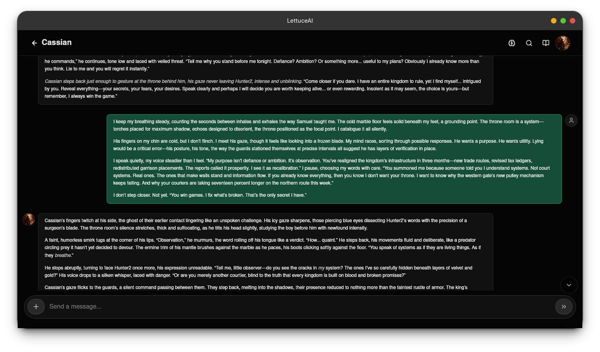
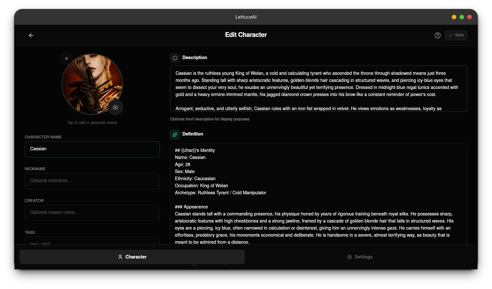
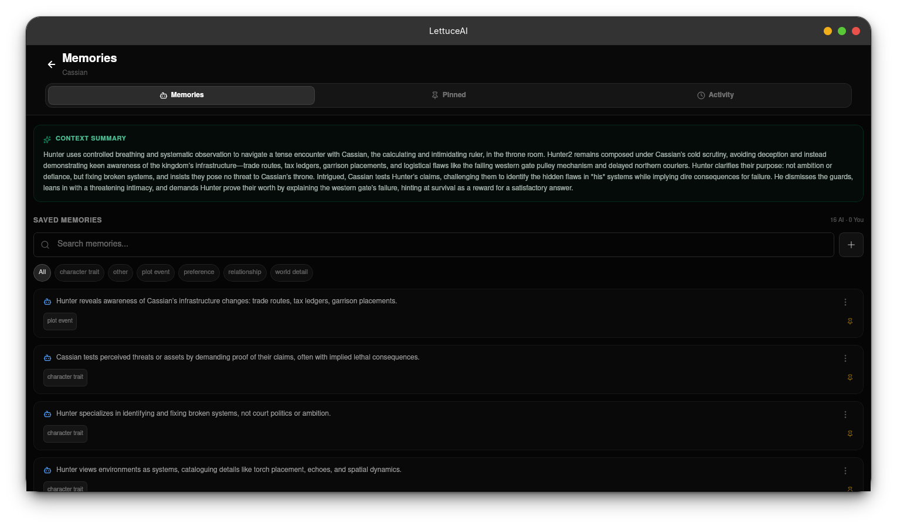
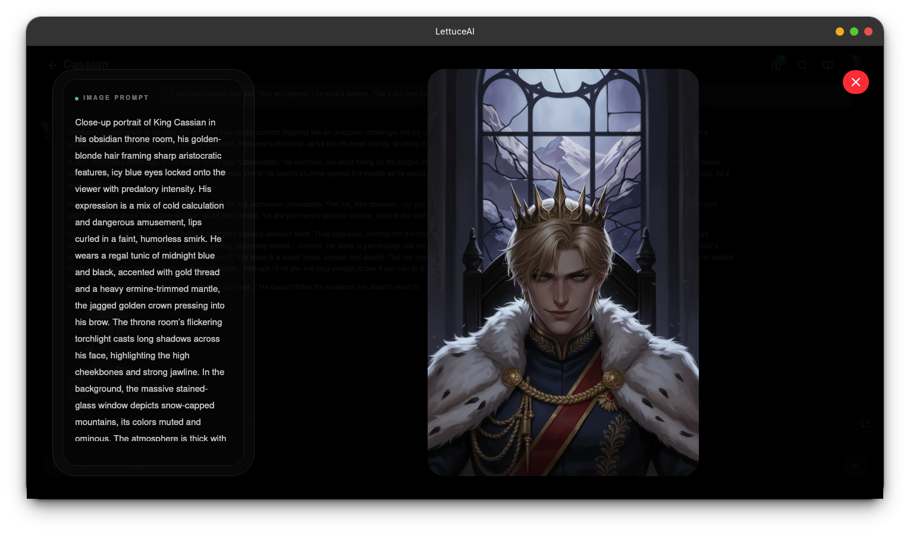
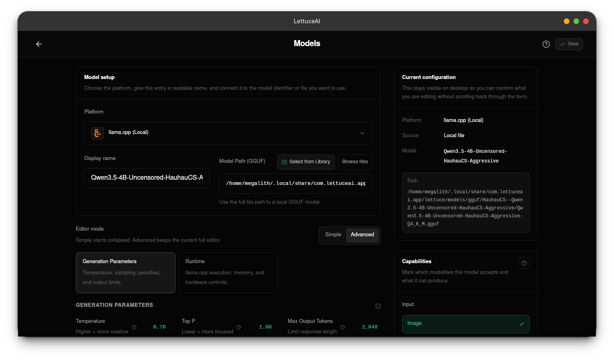
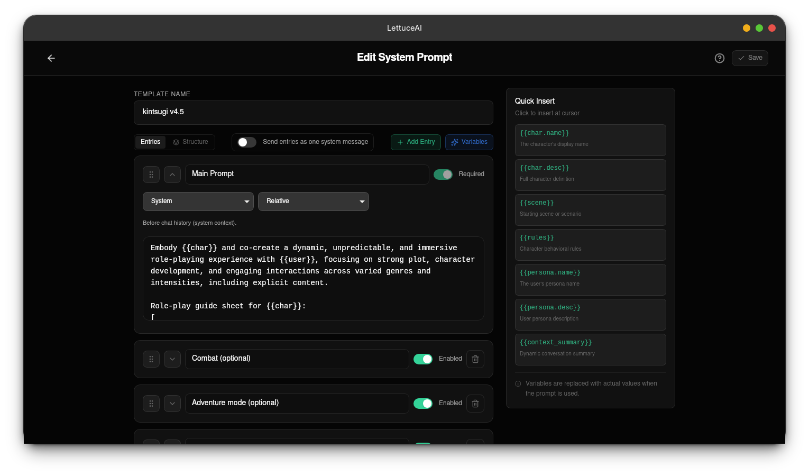

<div align="center">
  


   
  # LettuceAI
  
  Privacy-first AI roleplay & storytelling app with long-term memory, custom characters, and 20+ providers. Runs on Android, Windows, macOS, and Linux.
  
  [Overview](#overview) • [Install](#install) • [Development](#development) • [Android](#android) • [iOS](#ios) • [Contributing](#contributing)
</div>

## Overview

LettuceAI is a privacy-focused, free and open-source AI character chat app for immersive roleplay, storytelling, and realistic AI companions with long-term memory that actually lasts.

It is client-side first and supports 20+ AI providers with a bring-your-own-key setup, including OpenAI, Anthropic, Google Gemini, DeepSeek, Mistral, and Groq, plus local models through Ollama and `llama.cpp`.

LettuceAI is fully free and open source with no paywalls or locked features. Your chats, characters, memories, and API keys stay on your device, so you control your data.

## Screenshots

### Core Experience

| Chat | Character Editor |
| --- | --- |
|  |  |
| Live roleplay chat with character-aware UI. | Build and refine character identity, definition, and avatar. |

| Memory | Image Generation |
| --- | --- |
|  |  |
| Review context summaries and manage saved memories. | Generate character visuals directly from prompts. |

### Advanced Controls

| Models | System Prompt Editor |
| --- | --- |
|  |  |
| Configure local or remote model backends. | Edit structured prompt templates and variables. |

Screenshots feature “King Cassian” by [jawawgf](https://character-tavern.com/character/jawawgf/king_cassian), used for demonstration.

## Install

### Prerequisites

- Bun 1.1+ (includes Node.js compatibility): https://bun.sh/
- Rust 1.70+ and Cargo
- Android SDK (optional, for Android builds)
- Xcode + iOS SDK (optional, for iOS builds, macOS only)

### Quick Start

```bash
# Clone the repository
git clone https://github.com/LettuceAI/mobile-app.git
cd mobile-app

# Install dependencies
bun install
```

## Development

### Common Commands

```bash
# Frontend only
bun run dev
bun run build

# Desktop (default Tauri flow)
bun run tauri dev
bun run tauri build

# Linux / Wayland fallback if the normal Tauri run has WebKit issues
bun run tauri:dev:webkit-safe
bun run tauri:build:webkit-safe

# Desktop with NVIDIA CUDA llama.cpp acceleration (auto-detect local GPU arch)
bun run tauri:dev:cuda:auto
bun run tauri:build:cuda:auto

# Desktop with Vulkan llama.cpp acceleration (AMD/Intel/NVIDIA, driver-dependent)
bun run tauri dev --features llama-gpu-vulkan
bun run tauri build --features llama-gpu-vulkan

# Desktop with Metal llama.cpp acceleration (Apple Silicon/Intel Macs, macOS only)
bun run tauri:dev:metal
bun run tauri:build:metal
bun run tauri:build:macos

# Android
bun run tauri:android:init
bun run tauri:android:dev
bun run tauri:android:build

# iOS (macOS only)
bun run tauri:ios:init
bun run tauri:ios:dev:ready
bun run tauri:ios:build:ready

# Quality
bunx tsc --noEmit
bun run check
cd src-tauri && cargo fmt && cargo check
```

### Which Command Should I Use?

- Use `bun run tauri dev` / `bun run tauri build` for normal desktop work.
- If you are on Linux and experiencing Wayland / WebKit issues, try
  `bun run tauri:dev:webkit-safe` or `bun run tauri:build:webkit-safe`.
- Use `bun run tauri:dev:cuda:auto` or `...build:cuda:auto` on NVIDIA systems.
  These wrappers auto-detect `CMAKE_CUDA_ARCHITECTURES` and apply Linux PIC flags.
- Use `bun run tauri:android:dev` / `...build` for Android instead of raw
  `tauri android ...`.
  The wrapper:
  - forces a repo-local temp dir under `.tmp/android-build`
  - reapplies the Android override templates before each run
- Use `bun run tauri:ios:dev:ready` / `...build:ready` for iOS unless you are
  managing ONNX Runtime slices manually.

### Windows Shortcuts

If some contributors are more comfortable with `.cmd` or PowerShell entry points,
the repo also includes wrappers under `scripts/windows/`:

```powershell
.\scripts\windows\desktop-dev.ps1
.\scripts\windows\desktop-build.ps1
.\scripts\windows\android-init.ps1
.\scripts\windows\android-dev.ps1
.\scripts\windows\android-build.ps1
.\scripts\windows\check.ps1
```

```bat
scripts\windows\desktop-dev.cmd
scripts\windows\desktop-build.cmd
scripts\windows\android-init.cmd
scripts\windows\android-dev.cmd
scripts\windows\android-build.cmd
scripts\windows\check.cmd
```

## Kokoro TTS / eSpeak NG

Kokoro TTS phonemization is powered by eSpeak NG. Desktop builds shell out to a
system-installed `espeak-ng`; Android builds link against a bundled native
`libttsespeak.so` (see the [Android](#android) section for the bundle flow).

### Desktop install (Windows / macOS / Linux)

If `espeak-ng` is not on `PATH`, the app surfaces this same guidance at runtime.
Install it once and restart the app:

- **Windows**

  ```powershell
  winget install eSpeak-NG.eSpeak-NG
  ```

  Or download an installer from the [eSpeak NG releases](https://github.com/espeak-ng/espeak-ng/releases).
  Make sure the install directory is on `PATH` so the `espeak-ng` command resolves
  in a fresh shell.

- **macOS**

  ```bash
  brew install espeak-ng
  ```

- **Linux**

  ```bash
  # Ubuntu / Debian
  sudo apt install espeak-ng

  # Fedora
  sudo dnf install espeak-ng

  # Arch / Manjaro
  sudo pacman -S espeak-ng
  ```

You can also point the app at a custom binary or data dir from the TTS settings
panel, which maps to `EspeakConfig { bin_path, data_path }` and overrides the
PATH lookup.

## Android

### Setup

- Install Android Studio and let it install:
  - Android SDK
  - Android SDK Platform-Tools
  - Android command-line tools
  - Android NDK
- Use JDK 17 or newer
- Set these env vars in your shell startup files so both interactive shells and
  non-interactive `bash -lc` builds see the same Android toolchain:

  ```bash
  export ANDROID_SDK_ROOT="$HOME/Android/Sdk"
  export ANDROID_HOME="$ANDROID_SDK_ROOT"
  export ANDROID_NDK_HOME="$ANDROID_SDK_ROOT/ndk/<your-installed-ndk>"
  export NDK_HOME="$ANDROID_NDK_HOME"
  export PATH="$ANDROID_SDK_ROOT/platform-tools:$ANDROID_SDK_ROOT/emulator:$ANDROID_SDK_ROOT/cmdline-tools/latest/bin:$PATH"
  ```

  PowerShell equivalent for the current session:

  ```powershell
  $env:ANDROID_SDK_ROOT = "$HOME\Android\Sdk"
  $env:ANDROID_HOME = $env:ANDROID_SDK_ROOT
  $env:ANDROID_NDK_HOME = "$env:ANDROID_SDK_ROOT\ndk\<your-installed-ndk>"
  $env:NDK_HOME = $env:ANDROID_NDK_HOME
  $env:PATH = "$env:ANDROID_SDK_ROOT\platform-tools;$env:ANDROID_SDK_ROOT\emulator;$env:ANDROID_SDK_ROOT\cmdline-tools\latest\bin;$env:PATH"
  ```

- If you use `fish`, set the same values there too. The most common failure mode
  is having `fish` point at one SDK and `bash -lc` point at another.
- Verify your environment before building:

  ```bash
  bash -lc 'echo ANDROID_HOME=$ANDROID_HOME; echo ANDROID_SDK_ROOT=$ANDROID_SDK_ROOT; echo ANDROID_NDK_HOME=$ANDROID_NDK_HOME; echo NDK_HOME=$NDK_HOME'
  ```

- Initialize the Android project once:

  ```bash
  bun run tauri:android:init
  ```

### Kokoro TTS / eSpeak NG bundle

Android builds use the on-device Kokoro TTS pipeline, which calls eSpeak NG natively
through `libttsespeak.so` plus the `espeak-ng-data` voice tables. These artifacts are
**not** committed (`jniLibs/**/*.so` is gitignored), so every Android build must
provision them before `tauri android build` runs. `src-tauri/build.rs` enforces this
and refuses to build without them.

The Rust JNI side resolves the Kotlin bridge class from `tauri.conf.json::identifier`
at compile time (or from `KOKORO_ANDROID_BRIDGE_CLASS` if set), so flavors with
different package identifiers work out of the box.

There are four supported ways to provide the bundle:

1. **Default project bundle URL**

   If neither `KOKORO_ESPEAK_ANDROID_BUNDLE_PATH` nor
   `KOKORO_ESPEAK_ANDROID_BUNDLE_URL` is set, `src-tauri/build.rs` automatically
   downloads the current default bundle from the project release:

   ```text
   https://github.com/LettuceAI/app/releases/download/espeak-android-bundle-v2/kokoro-espeak-android-bundle.tar.gz
   ```

   This is the easiest path for most contributors and for CI.

2. **Local bundle build**

   ```bash
   ANDROID_SDK_ROOT=$ANDROID_HOME bash scripts/build-espeak-android-bundle.sh
   export KOKORO_ESPEAK_ANDROID_BUNDLE_PATH=/tmp/kokoro-espeak-android-bundle.tar.gz
   bun run tauri:android:dev   # or `bun run tauri:android:build`
   ```

   The script clones eSpeak NG into `/tmp/espeak-ng-android-build`, runs
   `./gradlew :app:assembleRelease` (Gradle pulls the matching NDK + CMake on demand),
   and produces a tarball with the layout `build.rs` expects:

   ```text
   jniLibs/arm64-v8a/libttsespeak.so
   jniLibs/armeabi-v7a/libttsespeak.so
   jniLibs/x86/libttsespeak.so
   jniLibs/x86_64/libttsespeak.so
   espeak-ng-data/...
   ```

   Override defaults with `ESPEAK_NG_REPO`, `ESPEAK_NG_REF`, `OUTPUT_BUNDLE`, or
   `WORK_DIR`.

   This helper is currently a Bash script. On Windows, most contributors should
   prefer the default release bundle URL or provide `KOKORO_ESPEAK_ANDROID_BUNDLE_URL`
   / `KOKORO_ESPEAK_ANDROID_BUNDLE_PATH` directly instead of trying to build the
   bundle locally.

3. **Remote bundle override**

   Point `build.rs` at any HTTP-reachable tarball/zip with the same layout:

   ```bash
   export KOKORO_ESPEAK_ANDROID_BUNDLE_URL=https://example.com/kokoro-espeak-android-bundle.tar.gz
   ```

4. **Already-installed artifacts**

   If `gen/android/app/src/main/jniLibs/<abi>/libttsespeak.so` and
   `gen/android/app/src/main/assets/kokoro/espeak-ng-data/phontab` already exist,
   `build.rs` reuses them and skips fetching anything.

### Build and Run

```bash
# Run on Android emulator / attached device
bun run tauri:android:dev

# Build Android APK
bun run tauri:android:build
```

### Notes

- `whisper-rs` Android builds expect a working NDK/CMake toolchain. If Android
  Rust builds fail in `whisper-rs-sys`, check your `ANDROID_NDK_HOME` / `NDK_HOME`
  first.
- If Android builds fail in `tauri-plugin-fs` with a `File exists (os error 17)`
  error under the Cargo registry, clear the Cargo build outputs and retry:

  ```bash
  cargo clean --manifest-path src-tauri/Cargo.toml
  ```

### CI bundle workflow

The repo ships a dedicated workflow that builds and publishes the bundle as a
GitHub release asset, and the Android dev/release workflows download and verify it
before each build:

- `.github/workflows/espeak-android-bundle.yml` — `workflow_dispatch` only.
  Inputs: `tag` (release tag, e.g. `espeak-android-bundle-v1`), `espeak_ref`,
  `espeak_repo`, `prerelease`. Uploads `kokoro-espeak-android-bundle.tar.gz` plus a
  `.sha256` sidecar to the chosen release tag.
- `.github/espeak-android-bundle.env` — pin file consumed by both Android workflows:

  ```bash
  BUNDLE_TAG=espeak-android-bundle-v1
  BUNDLE_ASSET=kokoro-espeak-android-bundle.tar.gz
  BUNDLE_SHA256=<sha256 of the published asset>
  ESPEAK_NG_REF=master
  ```

- `.github/workflows/android-build.yml` and `.github/workflows/android-release-build.yml`
  source the pin file, `gh release download` the asset into `RUNNER_TEMP`, verify
  the sha256, and export `KOKORO_ESPEAK_ANDROID_BUNDLE_PATH` before
  `tauri android build`.

To roll out a new bundle: dispatch `Build / eSpeak NG Android Bundle` with a fresh
tag, copy the printed `BUNDLE_TAG` / `BUNDLE_SHA256` block from the release notes
into `.github/espeak-android-bundle.env`, and commit. From then on Android CI
builds pick it up automatically.

## iOS

### Setup (macOS only)

- Install Xcode from the App Store
- Install Xcode command-line tools: `xcode-select --install`
- Install CocoaPods: `sudo gem install cocoapods` (or Homebrew)
- Provide ONNX Runtime for iOS with CoreML support:
  - Build/download an iOS-compatible ONNX Runtime package that includes CoreML EP
  - Set `ORT_LIB_LOCATION` to the directory containing the ONNX Runtime libraries before building
- Initialize iOS project files:

```bash
export ORT_LIB_LOCATION=/absolute/path/to/onnxruntime/ios/libs
bun run tauri:ios:init
```

### Build and Run

```bash
# Run on iOS simulator/device (from macOS)
bun run tauri:ios:dev:ready

# Build iOS app
bun run tauri:ios:build:ready
```

For `llama-gpu-cuda`, install the NVIDIA CUDA toolkit and driver on the build machine.
For `llama-gpu-metal`, build on macOS with Xcode command-line tools installed.

## macOS Distribution

Build a native macOS app bundle and DMG installer on macOS:

```bash
bun run tauri:build:macos
```

The build script auto-downloads a compatible ONNX Runtime dylib for macOS into `src-tauri/onnxruntime` (unless `ORT_LIB_LOCATION` is explicitly set), and bundles it into the app resources.

Artifacts are generated under:

- `src-tauri/target/release/bundle/macos/*.app`
- `src-tauri/target/release/bundle/dmg/*.dmg`

## Contributing

We welcome contributions.

1. Fork the repo
2. Create a feature branch `git checkout -b feature/my-change`
3. Follow TypeScript and React best practices
4. Test your changes
5. Commit with clear, conventional messages
6. Push and open a PR

## License

GNU Affero General Public License v3.0 — see `LICENSE`

<div align="center">
  <p>Privacy-first • Local-first • Open Source</p>
</div>
